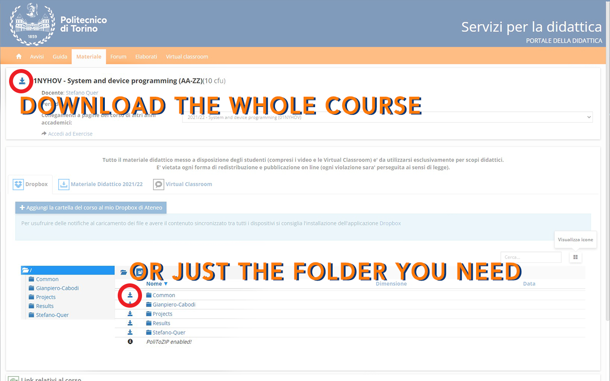

PoliToZIP is an open source chrome extension that allows downloading folders from the Teaching Portal of Politecnico di Torino.
Compared to other popular extensions, PoliToZIP supports downloading files uploaded under the Dropbox section in addition to an incredible high speed, an easy-to-use interface and a fully Open Source code!
The goal of the project is to provide students with an extension capable of surviving future changes made to the Teaching Portal thanks to the support of students themselves! Therefore I encourage you to contribute to the project here on Github! :)

## 🔧 Instructions

## 💻 How to install

PoliToZIP can be installed in two ways:

1. **CHROME WEB STORE**: You can add the extension to your browser by installing it from this [link](https://chrome.google.com/webstore/detail/politozip/gffjjgffaekehdjaphemecaglkagalkj).
    - 👍You will receive auto updates
    - 👎You won't be able to modify the extension
2. **MANUAL INSTALL**: Download this repository as a zip, extract it, from your browser go to the page `chrome://extensions/`, enable "Developer Options" from the top right corner, click on "Upload unpacked extension" and then select the unzipped PoliToZIP folder. Now you should be able to edit the extension's files and instantly see the changes in your browser.
    - 👎You won't receive auto updates
    - 👍You will be able to modify the extension

## 📢 Contributions

- If you want to **contribute** just fork this repo, manually install your forked repo and then edit your version of the code adding the features you would like to see in the official release/removing bugs. When everything is ready open a Pull Request.
- If you are **not familiar with coding** you can open an Issue in which you can explain to us what features/bugs you want/encountered and we will add/solve them as soon as possible!

## ❓ FAQ

- **Why is my download slow?**
  - Download speed depends on the number of sub-directories (not necessarily on the number of items).
- **Why is my download stuck?**
  - If your download crashes, an error will be displayed so unless you get a message from the extension, don't worry! The MB counter is updated whenever a file is downloaded, if it appears to be stuck it's only because the extension is downloading a HUGE file.
- **Why I get "status: 502"?**
  - The Teaching Portal doesn't like if you try to download many files in a short amount of time and for this reason sometimes it will block you. To solve this issue simply clear the cache of the browser.
- **Who are you?**
  - The hero PoliTo deserves, but not the one it needs.🦸‍♂️

## ⭐ Changelog

- **v0.2.7**: added a button to stop the current download
- **v0.2.6**: first release

## 🪲 Open issues

The following list contain a set of bugs/features that need to be resolved/implemented:

- Automate uploading the extension to the chrome web store via Github Actions.
- Make [settings.html](./src/pages/settings.html) a better settings page.
- Check for bugs by testing the extension on different scenarios.

## 🚀 Contributors

